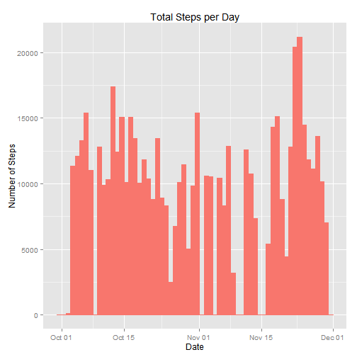
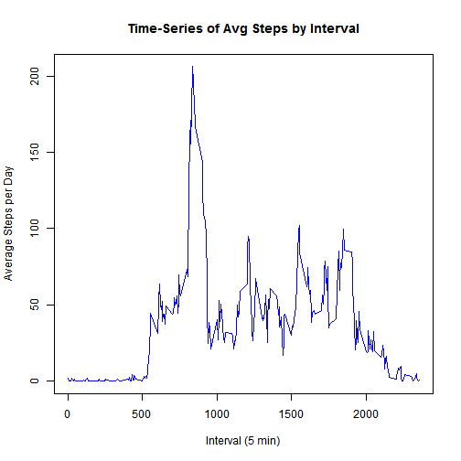
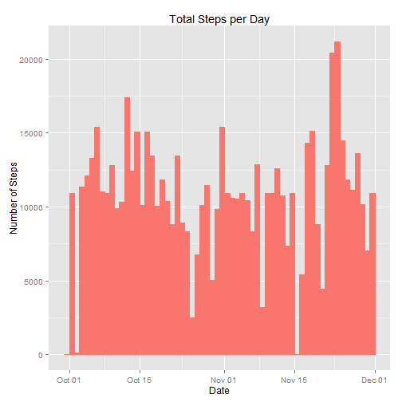
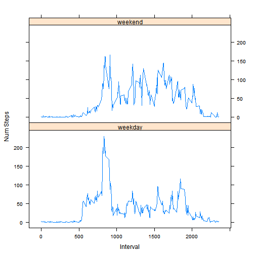

Reproducible Research Project
==============================


PART 1:  Loading and preprocessing the data
=============================================
Show any code that is needed to
1.  Load the data (i.e. read.csv())


```r
#setwd("C:/Users/dahra/Documents/R/WorkingDirectory/ReproducibleResearch")
data <- read.csv("C:/Users/dahra/Documents/R/WorkingDirectory/ReproducibleResearch/activity.csv")
```

2.  Process/transform the data (if necessary) into a format suitable for your analysis
    Tranformation 1:  Convert column 2 to date format
    Tranformation 2:  Remove null rows

```r
# Tranformation 1.  Convert Column 2 from factor to date
data[,2] <- as.Date(data[,2], format="%Y-%m-%d")

# Tranformation 2.  Remove nulls
tf_data <- na.omit(data)      #tf_data is the transformed data

head(tf_data,n=10)
```

```
##     steps       date interval
## 289     0 2012-10-02        0
## 290     0 2012-10-02        5
## 291     0 2012-10-02       10
## 292     0 2012-10-02       15
## 293     0 2012-10-02       20
## 294     0 2012-10-02       25
## 295     0 2012-10-02       30
## 296     0 2012-10-02       35
## 297     0 2012-10-02       40
## 298     0 2012-10-02       45
```

```r
tail(tf_data,n=10)
```

```
##       steps       date interval
## 17271     0 2012-11-29     2310
## 17272     0 2012-11-29     2315
## 17273     0 2012-11-29     2320
## 17274     0 2012-11-29     2325
## 17275     0 2012-11-29     2330
## 17276     0 2012-11-29     2335
## 17277     0 2012-11-29     2340
## 17278     0 2012-11-29     2345
## 17279     0 2012-11-29     2350
## 17280     0 2012-11-29     2355
```

PART 2:  What is mean total number of steps taken per day?
============================================================
For this part of the assignment, you can ignore the missing values in the dataset.

1.	Calculate the total number of steps taken per day


```r
#sum data by the date
sumdata <-aggregate(tf_data$steps, by=list(tf_data$date), FUN=sum)
head(sumdata)
```

```
##      Group.1     x
## 1 2012-10-02   126
## 2 2012-10-03 11352
## 3 2012-10-04 12116
## 4 2012-10-05 13294
## 5 2012-10-06 15420
## 6 2012-10-07 11015
```

```r
tail(sumdata)
```

```
##       Group.1     x
## 48 2012-11-24 14478
## 49 2012-11-25 11834
## 50 2012-11-26 11162
## 51 2012-11-27 13646
## 52 2012-11-28 10183
## 53 2012-11-29  7047
```

```r
#total number os steps
totalsum <- sum(tf_data$steps)
totalsum
```

```
## [1] 570608
```

2.  If you do not understand the difference between a histogram and a barplot, research the difference between them. Make a histogram of the total number of steps taken each day

```r
#install ggplot2 with the install.packages() function:
#install.packages("ggplot2")

#load the ggplot2 package
library(ggplot2)
```

```
## Warning: package 'ggplot2' was built under R version 3.2.1
```

```r
#Histogram Total Steps Per Day
qplot(date, 
      data=data, 
      weight=steps, 
      geom="histogram", 
      binwidth=1, 
      colour="black", 
      fill="white",
      main="Total Steps per Day",
      xlab="Date",
      ylab="Number of Steps"
      ) + guides(fill=FALSE) + theme(legend.position="none")
```

 

3.  Calculate and report the mean and median of the total number of steps taken per day

```r
library(plyr)

# Run the functions sum, mean, and median on the value of "steps" for each group, 
# broken down by date
cdata <- ddply(tf_data, "date", summarise,
               Sum    = sum(steps),
               mean = mean(steps),
               median   = median(steps)
              )
head(cdata)
```

```
##         date   Sum     mean median
## 1 2012-10-02   126  0.43750      0
## 2 2012-10-03 11352 39.41667      0
## 3 2012-10-04 12116 42.06944      0
## 4 2012-10-05 13294 46.15972      0
## 5 2012-10-06 15420 53.54167      0
## 6 2012-10-07 11015 38.24653      0
```

```r
tail(cdata)
```

```
##          date   Sum     mean median
## 48 2012-11-24 14478 50.27083      0
## 49 2012-11-25 11834 41.09028      0
## 50 2012-11-26 11162 38.75694      0
## 51 2012-11-27 13646 47.38194      0
## 52 2012-11-28 10183 35.35764      0
## 53 2012-11-29  7047 24.46875      0
```

PART 3:  What is the average daily activity pattern?
==================================

1.  Make a time series plot (i.e. type = "l") of the 5-minute interval (x-axis) and the average number of steps taken, averaged across all days (y-axis)


```r
intervaldata <- aggregate(
  data=data,
  steps~interval,
  FUN=mean,
  na.action=na.omit
)
colnames(intervaldata) <- c("Interval", "Steps")


with(intervaldata, {
  plot(
    x=Interval,
    y=Steps,
    type="l",
    col = "blue",
    main="Time-Series of Avg Steps by Interval",
    xlab="Interval (5 min)",
    ylab="Average Steps per Day"
    
  )
})
```

 


2.	Which 5-minute interval, on average across all the days in the dataset, contains the maximum number of steps?


```r
head(arrange(intervaldata,desc(Steps),Interval),n=1)
```

```
##   Interval    Steps
## 1      835 206.1698
```

PART 4:  Imputing missing values
==================================
Note that there are a number of days/intervals where there are missing values (coded as NA). The presence of missing days may introduce bias into some calculations or summaries of the data.

1.  Calculate and report the total number of missing values in the dataset (i.e. the total number of rows with NAs)


```r
# list rows of data that have missing values 
nulldata <- data[!complete.cases(data),]
nrow(nulldata)
```

```
## [1] 2304
```

2.	Devise a strategy for filling in all of the missing values in the dataset. The strategy does not need to be sophisticated. For example, you could use the mean/median for that day, or the mean for that 5-minute interval, etc.


```r
steps2 <- data.frame(data$steps)
steps2[is.na(steps2),] <- ceiling(tapply(X=data$steps,INDEX=data$interval,FUN=mean,na.rm=TRUE))
```

3.	Create a new dataset that is equal to the original dataset but with the missing data filled in.


```r
newData <- cbind(steps2, data[,2:3])
colnames(newData) <- c("steps", "date", "interval")
head(newData,n=20)
```

```
##    steps       date interval
## 1      2 2012-10-01        0
## 2      1 2012-10-01        5
## 3      1 2012-10-01       10
## 4      1 2012-10-01       15
## 5      1 2012-10-01       20
## 6      3 2012-10-01       25
## 7      1 2012-10-01       30
## 8      1 2012-10-01       35
## 9      0 2012-10-01       40
## 10     2 2012-10-01       45
## 11     1 2012-10-01       50
## 12     1 2012-10-01       55
## 13     1 2012-10-01      100
## 14     1 2012-10-01      105
## 15     1 2012-10-01      110
## 16     1 2012-10-01      115
## 17     0 2012-10-01      120
## 18     2 2012-10-01      125
## 19     2 2012-10-01      130
## 20     1 2012-10-01      135
```

```r
tail(newData,n=20)
```

```
##       steps       date interval
## 17549     8 2012-11-30     2220
## 17550     9 2012-11-30     2225
## 17551    10 2012-11-30     2230
## 17552     3 2012-11-30     2235
## 17553     1 2012-11-30     2240
## 17554     1 2012-11-30     2245
## 17555     2 2012-11-30     2250
## 17556     5 2012-11-30     2255
## 17557     4 2012-11-30     2300
## 17558     3 2012-11-30     2305
## 17559     0 2012-11-30     2310
## 17560     1 2012-11-30     2315
## 17561     1 2012-11-30     2320
## 17562     2 2012-11-30     2325
## 17563     3 2012-11-30     2330
## 17564     5 2012-11-30     2335
## 17565     4 2012-11-30     2340
## 17566     1 2012-11-30     2345
## 17567     1 2012-11-30     2350
## 17568     2 2012-11-30     2355
```

4.	Make a histogram of the total number of steps taken each day 


```r
qplot(date, 
      data=newData, 
      weight=steps, 
      geom="histogram", 
      binwidth=1, 
      colour="black", 
      fill="white",
      main="Total Steps per Day",
      xlab="Date",
      ylab="Number of Steps"
) + guides(fill=FALSE) + theme(legend.position="none")
```

 

4b. Calculate and report the mean andmedian total number of steps taken per day. 


```r
mdata <- ddply(newData, "date", summarise,
               Sum    = sum(steps),
               mean = mean(steps),
               median   = median(steps)
              )
head(mdata)
```

```
##         date   Sum     mean median
## 1 2012-10-01 10909 37.87847   34.5
## 2 2012-10-02   126  0.43750    0.0
## 3 2012-10-03 11352 39.41667    0.0
## 4 2012-10-04 12116 42.06944    0.0
## 5 2012-10-05 13294 46.15972    0.0
## 6 2012-10-06 15420 53.54167    0.0
```

```r
tail(mdata)
```

```
##          date   Sum     mean median
## 56 2012-11-25 11834 41.09028    0.0
## 57 2012-11-26 11162 38.75694    0.0
## 58 2012-11-27 13646 47.38194    0.0
## 59 2012-11-28 10183 35.35764    0.0
## 60 2012-11-29  7047 24.46875    0.0
## 61 2012-11-30 10909 37.87847   34.5
```
4c. Do these values differ from the estimates from the first part of the assignment? What is the impact of imputing missing data on the estimates of the total daily number of steps?

Yes, the medians and means have increased.

PART 5:  Are there differences in activity patterns between weekdays and weekends?
======================================================================
For this part the weekdays() function may be of some help here. Use the dataset with the filled-in missing values for this part.

1.	Create a new factor variable in the dataset with two levels - "weekday" and "weekend" indicating whether a given date is a weekday or weekend day.


```r
weektype <- data.frame(sapply(X = newData$date, FUN = function(day) {
  if (weekdays(as.Date(day)) %in% c("Saturday", "Sunday")) {
    day <- "weekend"
  } else {
    day <- "weekday"
  }
}))

addweektype <- cbind(newData, weektype)

colnames(addweektype) <- c("steps", "date", "interval", "weektype")

head(addweektype,n=10)
```

```
##    steps       date interval weektype
## 1      2 2012-10-01        0  weekday
## 2      1 2012-10-01        5  weekday
## 3      1 2012-10-01       10  weekday
## 4      1 2012-10-01       15  weekday
## 5      1 2012-10-01       20  weekday
## 6      3 2012-10-01       25  weekday
## 7      1 2012-10-01       30  weekday
## 8      1 2012-10-01       35  weekday
## 9      0 2012-10-01       40  weekday
## 10     2 2012-10-01       45  weekday
```

```r
tail(addweektype,n=10)
```

```
##       steps       date interval weektype
## 17559     0 2012-11-30     2310  weekday
## 17560     1 2012-11-30     2315  weekday
## 17561     1 2012-11-30     2320  weekday
## 17562     2 2012-11-30     2325  weekday
## 17563     3 2012-11-30     2330  weekday
## 17564     5 2012-11-30     2335  weekday
## 17565     4 2012-11-30     2340  weekday
## 17566     1 2012-11-30     2345  weekday
## 17567     1 2012-11-30     2350  weekday
## 17568     2 2012-11-30     2355  weekday
```


2.	Make a panel plot containing a time series plot (i.e. type = "l") of the 5-minute interval (x-axis) and the average number of steps taken, averaged across all weekday days or weekend days (y-axis). See the README file in the GitHub repository to see an example of what this plot should look like using simulated data.


```r
aggaddweektype <- aggregate(
  data=addweektype,
  steps ~ weektype + interval,
  FUN=mean
)

library("lattice")

xyplot(
  type="l",
  data=aggaddweektype,
  steps ~ interval | weektype,
  xlab="Interval",
  ylab="Num Steps",
  layout=c(1,2)
)
```

 
